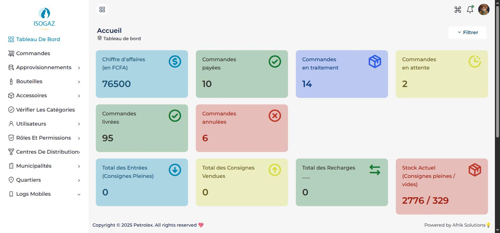
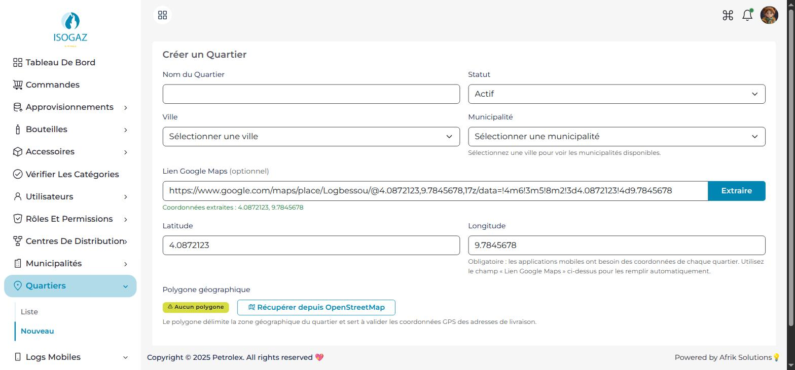
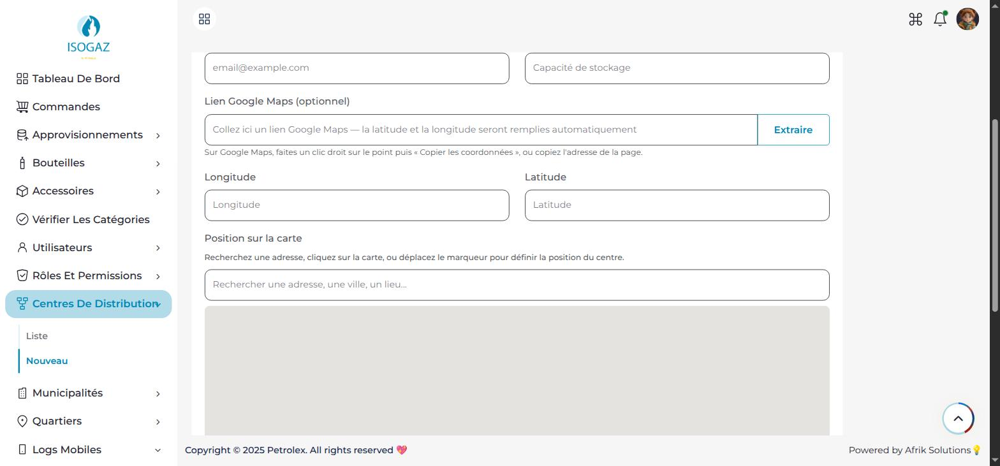
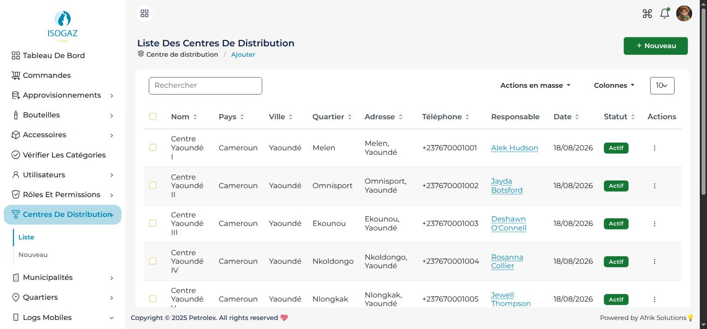
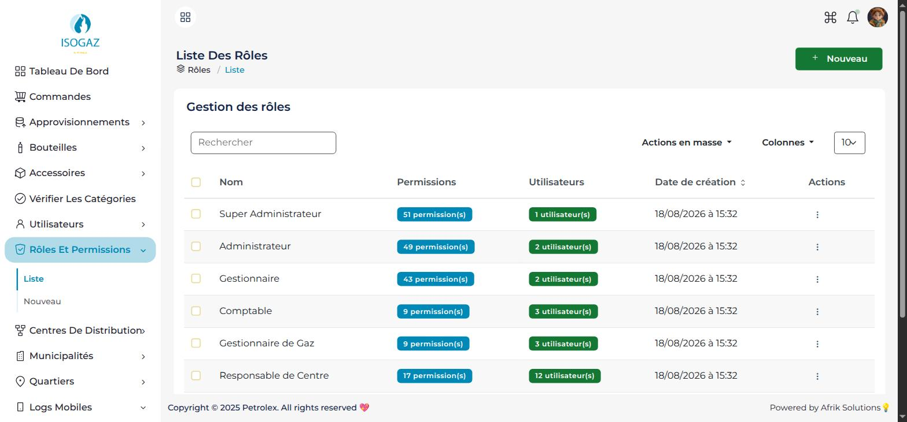
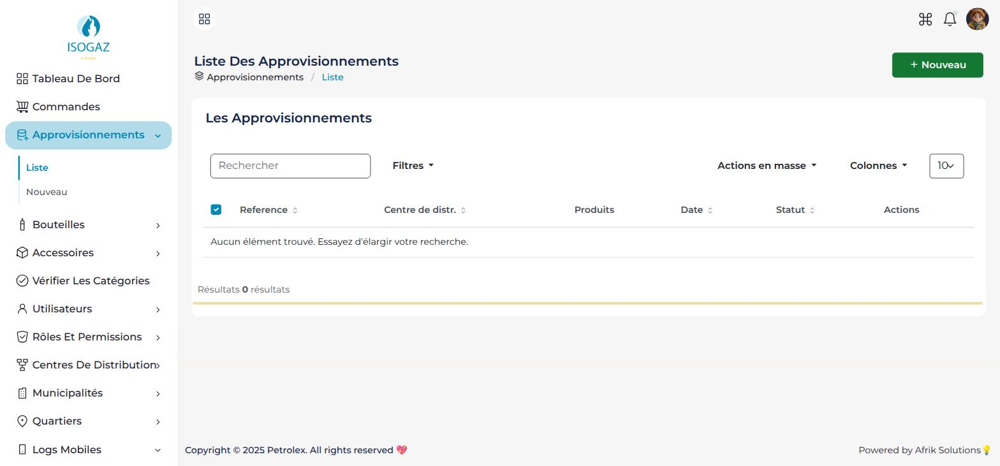
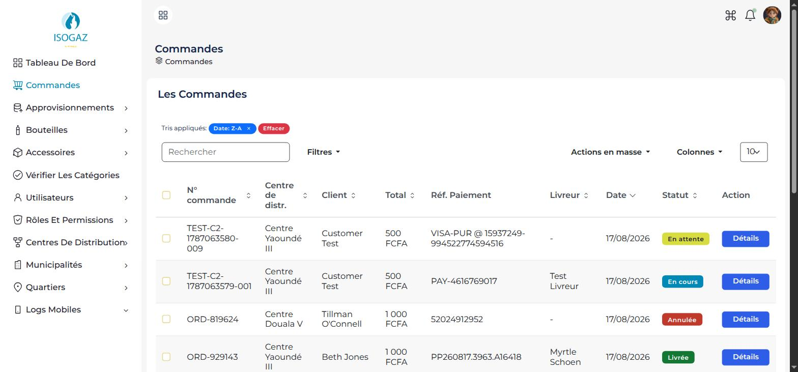

# Isogaz — Guide d'utilisation

**Public :** administrateurs et exploitants de la plateforme Isogaz
**Version :** 1.0 — 18/08/2026
**Panneau d'administration :** https://isogaz.net

---

## Comment lire ce guide

Ce guide suit l'ordre réel de mise en route : on part d'une plateforme vide, on la
configure couche par couche, puis on déroule une commande complète du catalogue jusqu'à
la livraison. **Les étapes de la partie 1 sont à faire dans l'ordre** — chaque niveau
s'appuie sur le précédent (un centre a besoin d'un quartier, un quartier a besoin d'une
commune, etc.).

---

# Partie 1 — Configuration initiale

## Étape 0 — Se connecter

1. Ouvrir **https://isogaz.net**.
2. Saisir l'e-mail et le mot de passe du compte administrateur.
3. Vous arrivez sur le **tableau de bord**.


*Le tableau de bord : indicateurs de commandes, chiffre d'affaires et état du parc de bouteilles*


> Seuls les comptes du personnel (administrateur, gestionnaire, comptable…) accèdent à
> cette interface. Un compte client sera refusé, c'est volontaire.

---

## Étape 1 — La géographie

**Pourquoi commencer par là :** tout le reste s'y accroche. Un centre de distribution est
situé dans un quartier, un quartier appartient à une commune, une commune à une ville.
C'est aussi la ville qui détermine les prix.

Les **pays et villes** sont livrés préconfigurés. Vous avez à gérer les deux niveaux fins :

### 1.1 Créer les communes
`Menu → Communes → Ajouter`
- Nom de la commune
- Ville de rattachement

### 1.2 Créer les quartiers
`Menu → Quartiers → Ajouter`
- Nom du quartier
- Commune de rattachement
- **Latitude et longitude** *(obligatoires)*

**Vous n'avez pas à lire les coordonnées vous-même.** Le formulaire comporte un champ
**« Lien Google Maps »** : collez-y le lien de l'endroit et cliquez sur **Extraire** — la
latitude et la longitude se remplissent seules.

Comment obtenir le lien :
1. Ouvrir **Google Maps** et chercher l'endroit.
2. Clic droit sur le point exact → **« Copier les coordonnées »** (ou copier l'adresse de
   la page dans la barre du navigateur, ou utiliser **Partager → Copier le lien**).
3. Coller dans le champ, cliquer sur **Extraire**.

Tous ces formats fonctionnent :

```
https://www.google.com/maps/place/Logbessou/@4.0872,9.7845,17z/...
https://maps.app.goo.gl/XXXXXXXX
https://maps.google.com/?q=4.0511,9.7679
4.0511, 9.7679
```

Si le lien ne contient aucune position exploitable, un message vous le signale et vous
pouvez saisir les deux nombres à la main.


*Après un clic sur « Extraire », la latitude et la longitude sont renseignées automatiquement*


> ⚠️ **Point de vigilance majeur.** Les coordonnées GPS ne sont pas facultatives. Un
> quartier enregistré sans latitude/longitude fait **planter l'application cliente** sur
> les téléphones des utilisateurs. Le formulaire les exige — ne cherchez pas à contourner.

---

## Étape 2 — Les centres de distribution

`Menu → Centres de distribution → Ajouter`

Un centre est un dépôt physique : il stocke les bouteilles et sert de point de départ aux
livraisons.

Renseigner :
- Nom du centre
- Quartier (donc, indirectement, la ville et donc la grille tarifaire appliquée)
- Coordonnées GPS du dépôt — elles servent au calcul du « centre le plus proche » proposé
  automatiquement au client. Comme pour les quartiers, vous pouvez **coller un lien Google
  Maps** et cliquer sur **Extraire** ; vous pouvez aussi cliquer directement sur la carte
  affichée sous le formulaire, ou déplacer le marqueur.
- Coordonnées de contact


*Le formulaire de création d'un centre : champ « Lien Google Maps », coordonnées et carte de positionnement*

Le centre **Logbessou** est présent par défaut comme centre de référence.


*La liste des centres de distribution*


---

## Étape 3 — Le catalogue produits

### 3.1 Types de bouteilles
`Menu → Produits → Types de bouteilles`

Les types de bouteilles se définissent **une seule fois, globalement pour toute la
plateforme** — ils ne sont pas à recréer centre par centre.

Le type **9 Kg** est livré par défaut. Les formats 12 Kg et 15 Kg sont à créer manuellement
si vous les commercialisez.

Pour chaque type, deux prix de base :
- **Prix bouteille complète** — le client repart avec la bouteille (consigne incluse)
- **Prix du contenu (recharge)** — le client échange sa bouteille vide, il ne paie que le gaz

> **Global n'est pas disponible partout.** Créer un type de bouteille le rend *connu* de la
> plateforme, pas *disponible à la vente*. Ce qui rend un produit réellement vendable dans
> un centre donné, c'est **l'approvisionnement** : les bouteilles physiques scannées à la
> réception (voir Étape A). Un centre sans stock de 12 Kg ne proposera pas de 12 Kg, même
> si le type existe globalement.

### 3.2 Accessoires
`Menu → Accessoires`
Détendeurs, tuyaux, réchauds… Chaque accessoire a son propre prix.

### 3.3 Catégories de produits
`Menu → Produits → Catégories`
Les catégories organisent le catalogue tel qu'il apparaît dans l'application cliente.

### 3.4 Autoriser les produits dans un centre
`Centres de distribution → [le centre] → Détails → Produits`

Cette étape répond à une question simple : **quels produits ce centre a-t-il le droit de
vendre ?**

Les types de bouteilles et accessoires créés aux étapes 3.1 à 3.3 existent au niveau de
toute la plateforme. Ils ne s'affichent pas automatiquement dans tous les centres : chaque
centre a sa propre liste de produits autorisés. Sur cet écran, vous cochez les produits que
ce centre commercialise.

Concrètement, pour qu'un client voie un produit dans l'application, **trois conditions**
doivent être réunies :

| # | Condition | Où cela se règle |
|---|---|---|
| 1 | Le produit existe sur la plateforme | Étape 3.1 à 3.3 (une fois pour toutes) |
| 2 | Le centre est autorisé à le vendre | **Cet écran** |
| 3 | Le centre a du stock physique | Étape A — approvisionnement et scan |

> **Symptôme classique en mise en route :** vous avez créé vos produits, mais l'application
> cliente affiche une liste vide. Dans neuf cas sur dix, c'est cette étape 3.4 qui a été
> sautée — ou le centre n'a pas encore reçu de bouteilles.

---

## Étape 4 — Les prix par ville

`Menu → Produits → Prix par ville`

Le gaz ne coûte pas le même prix à Douala et à Yaoundé. Ce module permet de **surcharger**
le prix de base ville par ville.

**Comment le système choisit le prix affiché au client :**

```
Le client commande depuis un centre
        ↓
Le centre est dans un quartier → une commune → une ville
        ↓
Existe-t-il un prix défini pour ce produit dans cette ville ?
        ├── OUI  → c'est ce prix qui s'applique
        └── NON  → le prix de base du type de bouteille s'applique
```

> ⚠️ Le prix affiché au client et le prix attendu à la validation de la commande sont
> **le même calcul**. Si vous modifiez un prix, il est actif immédiatement pour les
> nouvelles commandes.

---

## Étape 5 — Les utilisateurs et les droits

### 5.1 Les rôles
`Menu → Rôles`

Huit rôles existent : Super administrateur, Administrateur, Gestionnaire, Gestionnaire de
centre, Responsable gaz, Comptable, Livreur, Client.

Chaque rôle porte un ensemble de permissions unitaires (voir les commandes, créer un
utilisateur, gérer les paiements…). Vous pouvez ajuster finement les permissions d'un rôle
via `Rôles → [le rôle] → Gérer les permissions`.


*La gestion des rôles : nombre de permissions et d'utilisateurs pour chaque rôle*


### 5.2 Créer un utilisateur du personnel
`Menu → Utilisateurs → Ajouter`
- Identité, e-mail, téléphone
- Rôle
- Centre(s) de rattachement le cas échéant

### 5.3 Créer un livreur
Créer l'utilisateur avec le rôle **Livreur**, puis le rattacher à son centre de
distribution. Il pourra alors se connecter à l'application mobile livreur et recevoir des
commandes.

**Un livreur peut être rattaché à plusieurs centres.** C'est utile pour un livreur qui
couvre deux dépôts proches, ou en renfort ponctuel.

Chaque rattachement porte un état **actif / inactif**, ce qui permet de **suspendre un
livreur sur un centre sans supprimer son affectation** : il disparaît des livreurs
assignables sur ce centre, tout en restant disponible sur les autres, et l'historique de
ses livraisons passées reste intact. Pour le réactiver, il suffit de repasser le
rattachement en actif — inutile de le recréer.

---

## Étape 6 — Les versions d'application mobile

> 🔧 **Section technique — réservée à l'équipe technique / au super administrateur.**
> Ce réglage n'est pas destiné à l'exploitation courante : il se règle à la mise en service
> et à chaque publication d'une nouvelle version des applications mobiles. Les exploitants
> n'ont normalement pas à y toucher.

`Menu → Paramètres → Versions d'application`

On y déclare, pour Android et iOS, la version minimale acceptée. Un client sur une version
antérieure est invité (ou forcé) à mettre à jour avant de pouvoir commander. Ce mécanisme
sert lors d'un changement d'API non rétrocompatible : il évite qu'une application ancienne
continue d'appeler des services qui ont changé.

---

## Étape 7 — Contenus et contenus légaux

`Menu → Paramètres`
- **Conditions générales d'utilisation** et **Politique de confidentialité** — affichées
  dans l'application, exigées par les stores.
- **Coordonnées du support** — affichées dans l'application cliente.
- **Bannières publicitaires** — visuels promotionnels sur l'écran d'accueil client.

---

## ✅ Récapitulatif de la mise en route

| # | Étape | Sans elle… |
|---|---|---|
| 1 | Communes et quartiers (avec GPS) | Impossible de créer un centre ; l'app cliente plante |
| 2 | Centres de distribution | Aucun point de départ de livraison |
| 3 | Types de bouteilles et accessoires | Catalogue vide |
| 4 | Rattachement des produits au centre | Catalogue vide côté client malgré des produits créés |
| 5 | Prix par ville | Les prix de base s'appliquent partout |
| 6 | Utilisateurs et livreurs | Personne pour exploiter |
| 7 | Versions d'app et contenus légaux | Publication store bloquée |

---

# Partie 2 — Exploitation quotidienne : d'un stock vide à une commande livrée

Cette partie déroule le cycle complet. Suivez-la une fois de bout en bout pour valider
que votre installation est opérationnelle.

## Étape A — Approvisionner le centre en bouteilles

**Objectif :** faire entrer des bouteilles pleines dans le stock du centre.

### A.1 Créer l'approvisionnement (web)
`Menu → Approvisionnements → Ajouter`
- Centre de destination
- Fournisseur
- Types de produits et quantités attendues

L'approvisionnement passe en statut **En cours**.


*La liste des approvisionnements*


### A.2 Enregistrer les produits attendus
`Approvisionnement → Enregistrer les produits`

### A.3 Scanner les bouteilles reçues
Deux possibilités :
- **Depuis le web :** `Approvisionnement → Scanner les bouteilles`
- **Depuis l'application mobile Manager :** ouvrir l'approvisionnement, scanner chaque
  code-barres à la réception physique du camion

Chaque scan fait entrer une bouteille identifiée dans le stock, statut **En stock**.

> **Garde-fou :** une même bouteille ne peut pas être réceptionnée dans deux
> approvisionnements en même temps. Un scan en double est rejeté — c'est normal et voulu.
> En cas d'erreur, utiliser **Retirer la bouteille** sur l'approvisionnement concerné.

### A.4 Clôturer
**La clôture est une action manuelle, elle n'est pas automatique.** Quand tout le lot est
scanné, ouvrez l'approvisionnement et cliquez sur **Terminer**.

Ce clic n'est pas une formalité administrative : c'est lui qui **fait réellement entrer les
bouteilles en stock**. À ce moment précis, les bouteilles scannées passent du statut
*En attente de réception* à *En stock*, les bouteilles vides repartant chez le fournisseur
passent en *Retournée au fournisseur*, et le stock du centre est recalculé.

> ⚠️ Tant que l'approvisionnement n'est pas terminé, les bouteilles scannées ne sont **pas
> disponibles à la vente**. Un centre qui « ne propose rien » alors que le camion est arrivé
> a presque toujours un approvisionnement resté ouvert.

**Vérification :** `Menu → Bouteilles` doit maintenant lister vos bouteilles avec le statut
*En stock* et le bon centre.

---

## Étape B — Le client passe commande (application mobile)

Côté client, le parcours est :

1. **Inscription** avec son numéro de téléphone → réception d'un **code OTP** par SMS → validation.
2. **Ajout d'une adresse de livraison** rattachée à un quartier.
3. L'application propose automatiquement le **centre de distribution le plus proche**.
4. **Choix du produit** — par exemple une bouteille 9 Kg, avec deux options :
   - *Bouteille complète* — le client n'en a pas encore, il paie la consigne
   - *Recharge* — il échange sa bouteille vide, il paie seulement le gaz
5. **Choix du mode de livraison** : normale ou express (frais différents).
6. **Validation** → la commande est créée au statut **En attente**.

> Si le client dispose d'un solde de portefeuille (par exemple suite à un remboursement),
> ce solde est **automatiquement déduit**. S'il couvre tout le montant, la commande passe
> directement en **Payée** sans passer par Mobile Money.

**Côté administration :** la commande apparaît immédiatement dans `Menu → Commandes`.


*La liste des commandes : statut, centre, client, montant et livreur affecté*


---

## Étape C — Le paiement

Le client choisit **MTN Mobile Money** ou **Orange Money** et saisit son numéro.

Déroulé :
1. La plateforme envoie la demande de paiement à l'opérateur.
2. Le client reçoit une **notification de confirmation sur son téléphone** et saisit son code secret.
3. La plateforme **interroge activement l'opérateur** jusqu'à obtenir un statut définitif.
4. Selon la réponse : commande **Payée** ou paiement **Échoué**.

> ⚠️ Le passage en « Payée » n'est jamais déclenché par un simple appel entrant : il n'est
> validé qu'après vérification auprès de l'opérateur. Cela protège contre les tentatives
> de fraude, mais implique **un délai de quelques secondes à une minute** — c'est normal.

**En cas de doute sur un paiement :** `Menu → Rapports → Rapport de transactions`
permet de retrouver la transaction, son statut et sa référence opérateur.

---

## Étape D — Préparation et affectation du livreur

`Menu → Commandes → [la commande] → Détails`

1. Vérifier que le statut est bien **Payée**.
2. **Affecter un livreur** parmi ceux rattachés au centre.
3. Si besoin, **imprimer le ticket** de préparation.

La commande passe en **En traitement** et apparaît dans l'application du livreur.

---

## Étape E — Chargement et scan des bouteilles pleines

> **C'est le gestionnaire qui scanne, pas le livreur.** Le scan des bouteilles pleines
> sortantes est réservé aux profils d'encadrement : gestionnaire de centre, responsable gaz,
> gestionnaire, administrateur et super administrateur. Un compte livreur ne peut pas
> effectuer cette opération.

Au moment où la commande est remise au livreur, **le gestionnaire du centre** :

1. Ouvre la commande, depuis l'application Manager ou depuis l'administration web.
2. **Scanne le code-barres de chaque bouteille pleine** confiée au livreur.

Chaque bouteille scannée passe du statut *En stock* au statut *Chez le livreur* et est
définitivement rattachée à cette commande. C'est ce qui rend la consigne traçable : on sait
exactement quelle bouteille physique part chez quel client, et sous la responsabilité de
quel livreur.

**Pourquoi ce n'est pas le livreur :** c'est le principe du contrôle à la sortie du dépôt.
La personne qui remet le stock et la personne qui l'emporte ne sont pas la même, ce qui
rend les écarts d'inventaire imputables.

---

## Étape F — Livraison et suivi en temps réel

1. Le livreur **démarre la livraison** dans son application.
2. Sa position GPS est transmise en continu.
3. **Le client voit le livreur avancer sur une carte**, dans son application.
4. **Les gestionnaires et l'administration suivent la même carte en temps réel** :
   `Commandes → [la commande] → Suivi temps réel`. Le gestionnaire de centre voit donc où en
   sont ses livreurs en tournée sans avoir à les appeler — utile pour arbitrer une urgence,
   répondre à un client qui s'impatiente ou constater un arrêt anormal.

---

## Étape G — Reprise de la bouteille vide (consigne)

À l'arrivée chez le client, si la commande est une **recharge**, le livreur **scanne la
bouteille vide** que le client lui rend.

Ce qui se passe :
- La bouteille vide entre au stock du centre, statut *En stock, vide*.
- La bouteille pleine livrée passe au statut *Chez le client*.
- Si le code-barres scanné est inconnu du système (bouteille venue d'ailleurs), elle est
  **créée automatiquement** dans le stock du centre — rien n'est perdu.

**Contrôles automatiques :** une bouteille pleine ne peut pas être scannée comme reprise, et
une même bouteille ne peut pas être comptée deux fois sur la même ligne de commande.

---

## Étape H — Clôture

Le livreur **valide la livraison** : la commande passe en **Livrée**.

Le client peut alors :
- **Télécharger sa facture PDF**
- **Laisser une évaluation** sur la livraison

**Vérification finale :** `Menu → Bouteilles` — la bouteille livrée doit être *Chez le client*,
la bouteille reprise *En stock*.

---

# Partie 3 — Cas particuliers

## Annuler une commande et rembourser

`Commandes → [la commande] → Annuler` — possible **tant que la livraison n'a pas démarré**.

Le montant payé est **crédité sur le portefeuille du client**, qui l'utilisera
automatiquement sur sa prochaine commande. Il n'y a pas de reversement Mobile Money
automatique.

## Suivre une bouteille précise

`Menu → Bouteilles → rechercher le code-barres → Historique`
Vous obtenez toute la vie de la bouteille : réceptions, chargements, livraisons, retours.

## Diagnostiquer un problème sur l'application mobile

> 🔧 **Section technique.** Cet écran s'adresse à l'équipe technique. En exploitation
> courante, il suffit de savoir qu'il existe : quand un utilisateur signale un plantage,
> transmettez-lui l'heure et le type d'appareil, l'équipe technique retrouvera la trace ici.

`Menu → Logs mobiles`

Les applications mobiles y remontent leurs erreurs. C'est le premier endroit à consulter
quand un utilisateur signale un plantage ou un écran blanc : ces erreurs ne remontent nulle
part ailleurs.

## Consulter l'activité

`Menu → Tableau de bord` — indicateurs consolidés : commandes, chiffre d'affaires,
livraisons, état du parc de bouteilles, avec filtres par période et par centre.

`Menu → Rapports` — rapport de transactions détaillé, exportable.

---

# Annexe — Signification des statuts

### Commande
| Statut | Signification |
|---|---|
| En attente | Créée, pas encore payée |
| Payée | Paiement confirmé par l'opérateur |
| En traitement | Livreur affecté, préparation / tournée en cours |
| Livrée | Remise au client effectuée |
| Annulée | Annulée avant démarrage de la livraison |
| Échouée | Paiement définitivement refusé |

### Bouteille
| Statut | Signification |
|---|---|
| En stock | Disponible dans un centre |
| Chez le livreur | Chargée, en tournée |
| Chez le client | Consignée chez un client |
| En attente de réception | Annoncée par le fournisseur, pas encore scannée |
| Retournée au fournisseur | Repartie pour remplissage |
| Perdue / volée | Sortie du parc |

### Paiement
| Statut | Signification |
|---|---|
| En attente | Demande créée |
| En cours | Client sollicité par l'opérateur |
| Payé | Encaissement confirmé |
| Échoué | Refusé ou expiré |
| Remboursé | Recrédité au client |
